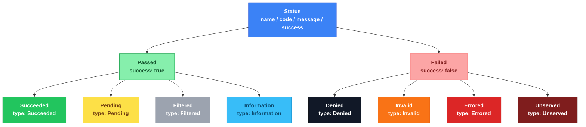

<div align="center">

# kiit.codes

**A status/error** taxonomy conceptually similar to Http Status Codes/gRPC codes for Kotlin.

[](https://central.sonatype.com/artifact/dev.kiit/kiit-codes)
[](https://github.com/slatekit/kiit-codes/actions)
[](./LICENSE)
[](https://kotlinlang.org)

Part of the [Kiit](https://www.kiit.dev) framework · [kiit.dev/codes](https://www.kiit.dev/codes) · [Blog post](#) · [Video walkthrough](#)

</div>

---

## 📚 Table of Contents

- [ℹ️ About](#ℹ️-about)
- [🧩 The problem](#-the-problem)
- [💡 The idea](#-the-idea)
- [🚀 Quick start](#-quick-start)
- [🧠 Core concepts](#-core-concepts)
- [📖 Built-in codes](#-built-in-codes)
- [🌐 HTTP conversion](#-http-conversion)
- [⚠️ Exceptions](#️-exceptions)
- [🛠️ Use cases](#️-use-cases)
- [✅ When to use this](#-when-to-use-this-and-when-not-to)
- [📦 Requirements](#-requirements)
- [🗺️ Roadmap](#️-roadmap)
- [🤝 Contributing](#-contributing)
- [📄 License](#-license)

---

## ℹ️ About

**kiit.codes** is a platform-agnostic set of status and error code types for Kotlin Multiplatform. It describes the outcome of any operation — a service call, a background job step, an API request, a CLI command — using a consistent, structured shape instead of raw exceptions or ad-hoc booleans.

Every outcome is a `Status`: a stable `name`, a `code`, a constant `message`, and a `success` flag, grouped into a small, closed taxonomy (`Succeeded`, `Pending`, `Filtered`, `Information`, `Denied`, `Invalid`, `Errored`, `Unserved`) that's consistent across every layer and every target — JVM, Android, JS/TypeScript, and iOS.

It's a small, dependency-free library — you can adopt it on its own, independent of the rest of [Kiit](https://www.kiit.dev).

```json
{
    "name"   : "TOKEN_EXPIRED",
    "type"   : "Denied",
    "code"   : 400009,
    "success": false,
    "message": "Session token expired"
}
```

## 🧩 The problem

Most codebases end up with three incompatible ways of describing "what happened": exceptions (expensive, unstructured, and easy to over- or under-catch), raw booleans (`success: Boolean` — no room to say *why*), and ad-hoc HTTP status codes borrowed as a stand-in for domain meaning even outside an HTTP context.

None of these compose well. A background job doesn't have an HTTP status. A CLI command's "help was printed" isn't a failure, but it also isn't the same kind of success as "the record was created." And nothing about a raw `Int` or `Boolean` tells you whether a given failure is safe to retry, worth alerting on, or just the caller's fault.

## 💡 The idea

**kiit.codes is a closed taxonomy of outcomes, layered on top of open, extensible codes.**

The eight categories (`Passed = Succeeded | Pending | Filtered | Information`, `Failed = Denied | Invalid | Errored | Unserved`) are fixed by design — every consumer branches on the same shape. Individual codes *within* a category are yours to extend: construct a `Passed.*` or `Failed.*` subtype directly for any domain-specific outcome, and it still slots into the same taxonomy for logging, aggregation, and HTTP conversion.

## 🚀 Quick start

**Gradle (Kotlin DSL):**

```kotlin
dependencies {
    implementation("dev.kiit:kiit-codes:0.1.2")
}
```

**Return a status instead of throwing:**

```kotlin
fun createUser(email: String): Status {
    if (email.isBlank()) return Codes.BAD_REQUEST
    // ... create the user ...
    return Codes.CREATED
}
```

**Branch on the outcome:**

```kotlin
when (val status = createUser(email)) {
    is Passed -> log.info("ok: ${status.name}")
    is Failed -> log.warn("failed: ${status.name} — ${status.message}")
}
```

**Cross a call boundary with `StatusException`:**

```kotlin
throw StatusException(Codes.UNAUTHORIZED)
```

**Convert to HTTP when you need a real status code:**

```kotlin
val http = CodesToHttp()
http.toCode(Codes.CREATED)   // 201
http.toCode(Codes.DENIED)    // 401
```

See [`samples/sample1`](./samples/sample1) for a runnable end-to-end example.

## 🧠 Core concepts

```
Status = Passed    | Failed
Passed = Succeeded | Pending | Filtered | Information
Failed = Denied    | Invalid | Errored  | Unserved
```



| Term | What it is |
|---|---|
| **Status** | The outcome of an operation — `name`, `code`, `message`, `success`. Sealed: `Passed` or `Failed`. |
| **Passed** | `Succeeded` (primary purpose completed), `Pending` (accepted, not yet done), `Filtered` (excluded — not processed, or processed and discarded), `Information` (metadata output, e.g. `HELP`). |
| **Failed** | `Denied` (security/access-control), `Invalid` (bad input), `Errored` (known business-rule failure), `Unserved` (valid & permitted, but can't be handled right now). |
| **Codes** | The built-in registry of common `Status` instances — optional, and duplicate-checked at init time. |
| **CodeLookup** | Bidirectional conversion between a `Status` and a target protocol's code (`toCode`/`toStatus`), direction-explicit so the two code spaces can't be confused. |
| **StatusException** | Carries a `Status` across a call boundary that can only communicate via exceptions. `StatusError` on JS/iOS for idiomatic naming. |

## 📖 Built-in codes

The `Codes` object provides a standard registry — using it is optional, and you can construct any `Passed`/`Failed` subtype directly for domain-specific outcomes.

| Category | Range | Examples |
|---|---|---|
| Succeeded | 200000-200999 | `SUCCESS`, `CREATED`, `UPDATED`, `FETCHED`, `DELETED`, `HANDLED` |
| Pending | 201000-201999 | `PENDING`, `QUEUED`, `CONFIRM` |
| Filtered | 202000-202999 | `SKIPPED` (not processed), `DISCARDED` (processed, result thrown away) |
| Information | 203000-203999 | `HELP`, `ABOUT`, `VERSION`, `EXIT` |
| Denied | 400000-400999 | `DENIED`, `UNAUTHENTICATED`, `UNAUTHORIZED` |
| Invalid | 401000-401999 | `BAD_REQUEST`, `INVALID`, `NOT_FOUND` |
| Errored | 402000-402999 | `MISSING`, `FORBIDDEN`, `CONFLICT`, `DEPRECATED`, `ERRORED` |
| Unserved | 403000-403999 | `UNIMPLEMENTED`, `UNSUPPORTED`, `TIMEOUT`, `RATE_LIMITED`, `UNREACHABLE`, `UNDER_MAINTENANCE`, `UNEXPECTED` |

Each category gets 1000 numeric slots, leaving room for custom codes alongside the built-ins.
Every code's uniqueness — and its placement inside its own category's range — is enforced at
object-init time, so a mistake fails loudly the first time `Codes` is touched rather than
silently producing a wrong HTTP mapping.

## 🌐 HTTP conversion

`CodesToHttp` maps `Status` to HTTP status codes: a compiler-exhaustive category default (`Succeeded` → 200, `Denied` → 401, etc.), layered with a small overrides table for the handful of codes that differ (`CREATED` → 201, `NOT_FOUND` → 404). `toStatus` is derived from `toCode`, so the two directions can never drift apart.

```kotlin
val http = CodesToHttp()
http.toStatus(404)?.name   // "NOT_FOUND"
http.toStatus(999)         // null — unrecognized code, no guessed fallback
```

`CompositeLookup` composes a base lookup with your own extensions, keyed by `Status` instance so custom, unregistered statuses are reverse-lookupable too:

```kotlin
val PAYMENT_DECLINED = Failed.Errored("PAYMENT_DECLINED", 700123, "Payment declined")
val lookup = CompositeLookup(base = CodesToHttp(), extensions = mapOf(PAYMENT_DECLINED to 402))
lookup.toCode(PAYMENT_DECLINED) // 402
```

## ⚠️ Exceptions

`StatusException` (JVM/Android) and its platform aliases let you propagate a `Status` across a call boundary that can only communicate via exceptions, without losing the structured information:

| Platform | Class | How |
|---|---|---|
| JVM / Android | `StatusException` | `commonMain` — extends `Exception` |
| JS / TS | `StatusError` | `jsMain` — `@JsExport` subclass |
| iOS / Swift | `StatusError` | `iosMain` — `@ObjCName` subclass |

```kotlin
try {
    // ...
} catch (e: StatusException) {
    when (e.status) {
        is Failed.Denied         -> // handle auth failure
        is Failed.Invalid        -> // handle bad input
        is Failed.Errored        -> // handle known business-rule failure
        is Failed.Unserved  -> // handle capacity / timeout / unimplemented / unexpected
        is Passed                -> // n/a — Passed statuses aren't normally thrown
    }
}
```

## 🛠️ Use cases

1. **Service layers** — return a `Status` instead of throwing for expected failures; reserve exceptions for boundary crossings.
2. **API responses** — a consistent, structured error body across every endpoint, convertible to a real HTTP code via `CodesToHttp`.
3. **Background jobs / CLIs** — `Pending`/`Information` categories that don't map cleanly to HTTP but still need a consistent shape.
4. **Logging & metrics** — `name` and the category discriminant (`Status.toType`) are stable, aggregable keys.
5. **Cross-platform consumers** — the same taxonomy on JVM, Android, JS/TypeScript, and iOS.

## ✅ When to use this and when not to

**Good fit if:**
1. You want one consistent shape for "what happened" across services, jobs, APIs, and CLIs.
2. You need to convert internal outcomes to HTTP (or another protocol) without hardcoding numeric ranges.
3. You're building or consuming a Kotlin Multiplatform target (JS/iOS) and want idiomatic error types on each side.

**Probably not necessary if:**
1. Your app is entirely internal, single-platform, and exceptions already communicate everything you need.
2. You need per-instance runtime detail (e.g. "field `email` was invalid") baked directly into the status — `message` here is constant-only by design; runtime detail belongs one layer up (see [kiit-result](https://github.com/slatekit/kiit)).

## 📦 Requirements

1. Kotlin Multiplatform — JVM, Android, JS (IR), iOS (arm64, simulator arm64, x64)
2. No external runtime dependencies

## 🗺️ Roadmap

- [ ] npm publish pipeline for JS consumers (`@kiit/codes`)
- [ ] SPM / XCFramework pipeline for Swift consumers
- [ ] GitHub Actions workflow for CI + Maven Central publish

Track progress or open a discussion in [Issues](https://github.com/slatekit/kiit-codes/issues).

## 🤝 Contributing

Contributions are welcome — see [BUILD.md](./BUILD.md) for build, test, and publish instructions.

## 📄 License

[Apache License 2.0](./LICENSE)

---

<div align="center">

kiit.codes is one module of **[Kiit](https://www.kiit.dev)** — a lightweight, modular, 100% Kotlin framework for building server apps, APIs, CLIs, and jobs. Adopt one module at a time.

</div>
