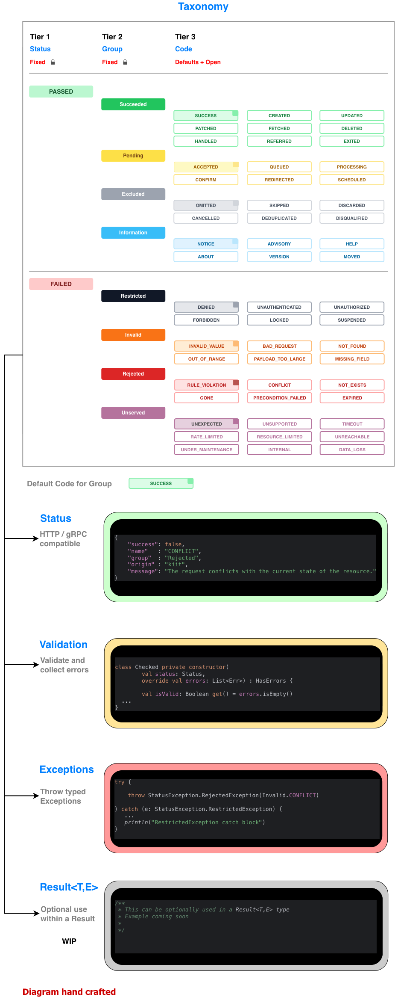
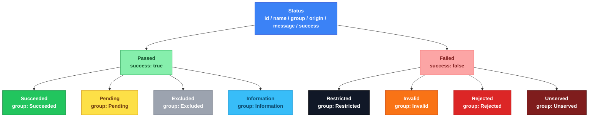

<div align="center">

# kiit.codes

A library to classify and handle success and failure at any layer of an app. Compatible with all gRPC and most common HTTP status codes. Usable as a plain status, validation, structured exceptions or result type handling.

[](https://central.sonatype.com/artifact/dev.kiit/kiit-codes)
[](https://github.com/slatekit/kiit-codes/actions/workflows/ci.yml)
[](./LICENSE)
[](https://kotlinlang.org)

Part of the [Kiit](https://www.kiit.dev) framework · [kiit.dev/codes](https://www.kiit.dev/codes) · [Blog post](#) · [Video walkthrough](#)

</div>

---


## 📚 Table of Contents

| Topic | Description |
|---|---|
| **Overview** | |
| ℹ️ [About](#ℹ️-about) | What kiit.codes is and the taxonomy + exception model it provides |
| 🧩 [The problem](#-the-problem) | Why exceptions, raw booleans, and borrowed HTTP codes don't compose well |
| 💡 [The idea](#-the-idea) | A closed taxonomy of outcomes, layered on top of open, extensible codes |
| **Start** | |
| 🚀 [Quick start](#-quick-start) | Install the library and see status, `Checked`, and exception examples |
| **Reference** | |
| 🧠 [Core concepts](#-core-concepts) | The `Status`/`Passed`/`Failed` hierarchy and how the pieces relate |
| 📖 [Built-in codes](#-built-in-codes) | The `Codes` registry of common statuses, and how to add your own |
| 🌐 [HTTP / gRPC](#-http-conversion) | Mapping a `Status` to and from a real HTTP status code, or a gRPC status code |
| 🧾 [Err & Checked](#-err--checked) | Carrying per-occurrence error detail and reporting every problem at once |
| ⚠️ [Exceptions](#️-exceptions) | The sealed `StatusException` family for exception-only call boundaries |
| **Guidance** | |
| 🛠️ [Use cases](#️-use-cases) | Where this fits — services, APIs, background jobs, logging |
| ✅ [When to use this](#-when-to-use-this-and-when-not-to) | Good-fit and not-necessary scenarios, so you can decide quickly |
| ❓ [FAQ](#-faq) | Design rationale, comparisons to alternatives, adoption, and maturity |
| **Project** | |
| 📦 [Requirements](#-requirements) | Supported platforms and the (lack of) runtime dependencies |
| 🗺️ [Roadmap](#️-roadmap) | Publishing pipelines and CI work planned but not yet done |
| 🤝 [Contributing](#-contributing) | How to build, test, and submit changes |
| 📄 [License](#-license) | Licensing terms for this project |

---

## ℹ️ About

**kiit.codes** is a platform-agnostic set of status and error code types for Kotlin Multiplatform. It describes the outcome of any operation — a service call, a background job step, an API request, a CLI command — using a consistent, structured shape instead of raw exceptions or ad-hoc booleans.

It's really two things working together, not one:

1. **A closed taxonomy.** Every outcome is a `Status`, a stable `name`, a derived `id`, a `group`, an `origin`, a constant `message`, and a `success` flag, grouped into a small, fixed set of categories (`Succeeded`, `Pending`, `Excluded`, `Information`, `Restricted`, `Invalid`, `Rejected`, `Unserved`) that's consistent across every layer and every target — JVM, Android, JS/TypeScript, and iOS.
2. **A complete, exception-based way to use it.** `Checked` captures the actual detail behind a failure, and a sealed `StatusException` family lets you throw and catch that detail without ever losing structure, no `Result` type, no functional-programming buy-in required.

It's a small, dependency-free library — you can adopt it on its own, independent of the rest of [Kiit](https://www.kiit.dev). A separate module, `kiit-results`, builds a `Result<T, E>` type on top of this same taxonomy for anyone who prefers explicit return values over exceptions, but it isn't required to get real value out of this package alone.

```json
{
    "id"     : "kiit.TOKEN_EXPIRED",
    "name"   : "TOKEN_EXPIRED",
    "group"  : "Restricted",
    "origin" : "kiit",
    "success": false,
    "message": "Session token expired"
}
```




## 🧩 The problem

Most codebases end up with three incompatible ways of describing "what happened": exceptions (expensive, unstructured, and easy to over- or under-catch), raw booleans (`success: Boolean` — no room to say *why*), and ad-hoc HTTP status codes borrowed as a stand-in for domain meaning even outside an HTTP context.

None of these compose well. A background job doesn't have an HTTP status. A CLI command's "help was printed" isn't a failure, but it also isn't the same kind of success as "the record was created." And a huge amount of exception handling is boilerplate, the same custom exception class, rewritten per domain, mostly just to get dispatch and a place to stash a couple of fields.

## 💡 The idea

**kiit.codes is a closed taxonomy of outcomes, layered on top of open, extensible codes, with a real, exception-based way to act on both.**

The eight categories (`Passed = Succeeded | Pending | Excluded | Information`, `Failed = Restricted | Invalid | Rejected | Unserved`) are fixed by design — every consumer branches on the same shape. Individual codes *within* a category are yours to extend: construct a `Passed.*` or `Failed.*` subtype directly for any domain-specific outcome, tagged with your own `origin`, and it still slots into the same taxonomy for logging, aggregation, and HTTP conversion.

On top of that, `Checked` and a sealed `StatusException` give you a structured, compiler-checked replacement for most custom exception classes, not a taxonomy waiting for a second library to become useful.

## 🚀 Quick start

**Gradle (Kotlin DSL):**

```kotlin
dependencies {
    implementation("dev.kiit:kiit-codes:0.1.2")
}
```

**Return a status, and branch on it exhaustively:**

```kotlin
import kiit.codes.*

fun authorize(userId: String, requesterId: String): Status =
    if (userId != requesterId) Restricted.UNAUTHORIZED else Succeeded.SUCCESS

when (val status = authorize(userId, requesterId)) {
    is Passed -> log.info("ok: ${status.name}")
    is Failed -> log.warn("failed: ${status.name} — ${status.message}")
}
```

**Return `Checked` to carry *why*, and `collect` to report every problem at once:**

```kotlin
import kiit.codes.*

fun createUser(email: String): Checked =
    if (users.containsKey(email)) Checked.failure(Rejected.CONFLICT, listOf(Err.on("email", email, "already registered")))
    else Checked.success(Succeeded.CREATED)

fun checkEmail(email: String): Checked =
    if (email.contains("@")) Checked.success()
    else Checked.failure(Invalid.INVALID_VALUE, listOf(Err.on("email", email, "must contain @")))

val result = collect(createUser(email), checkEmail(email))
if (!result.isValid) {
    // result.errors has every problem found, not just the first
}
```

**Throw with structure, catch with structure:**

```kotlin
import kiit.codes.*

throw StatusException.RestrictedException(Restricted.UNAUTHORIZED)

try {
    // ...
} catch (e: StatusException.RestrictedException) {
    // handled without ever touching a when block
}
```

See [`samples/sample-kotlin`](./samples/sample-kotlin) for a runnable end-to-end example, or
[`samples/sample-java`](./samples/sample-java) for the same library used from plain Java.

## 🧠 Core concepts

```
Status = Passed     | Failed
Passed = Succeeded  | Pending | Excluded | Information
Failed = Restricted | Invalid | Rejected | Unserved
```


```mermaid
graph TD
    classDef statusNode        fill:#3b82f6,stroke:#1d4ed8,color:#ffffff,font-weight:bold
    classDef passedNode        fill:#86efac,stroke:#16a34a,color:#14532d,font-weight:bold
    classDef succeededNode     fill:#22c55e,stroke:#15803d,color:#ffffff,font-weight:bold
    classDef pendingNode       fill:#fde047,stroke:#ca8a04,color:#713f12,font-weight:bold
    classDef excludedNode      fill:#9ca3af,stroke:#6b7280,color:#ffffff,font-weight:bold
    classDef informationNode   fill:#38bdf8,stroke:#0284c7,color:#0c4a6e,font-weight:bold
    classDef failedNode        fill:#fca5a5,stroke:#f87171,color:#7f1d1d,font-weight:bold
    classDef restrictedNode    fill:#111827,stroke:#000000,color:#ffffff,font-weight:bold
    classDef invalidNode       fill:#f97316,stroke:#c2410c,color:#ffffff,font-weight:bold
    classDef rejectedNode      fill:#dc2626,stroke:#b91c1c,color:#ffffff,font-weight:bold
    classDef unservedNode      fill:#7f1d1d,stroke:#450a0a,color:#ffffff,font-weight:bold

    Status["Status<br/>id / name / group / origin / message / success"]:::statusNode

    Passed["Passed<br/>success: true"]:::passedNode
    Failed["Failed<br/>success: false"]:::failedNode

    Succeeded["Succeeded<br/>group: Succeeded"]:::succeededNode
    Pending["Pending<br/>group: Pending"]:::pendingNode
    Excluded["Excluded<br/>group: Excluded"]:::excludedNode
    Information["Information<br/>group: Information"]:::informationNode

    Restricted["Restricted<br/>group: Restricted"]:::restrictedNode
    Invalid["Invalid<br/>group: Invalid"]:::invalidNode
    Rejected["Rejected<br/>group: Rejected"]:::rejectedNode
    Unserved["Unserved<br/>group: Unserved"]:::unservedNode

    Status --> Passed
    Status --> Failed
    Passed --> Succeeded
    Passed --> Pending
    Passed --> Excluded
    Passed --> Information
    Failed --> Restricted
    Failed --> Invalid
    Failed --> Rejected
    Failed --> Unserved
```

| Term | What it is |
|---|---|
| **Status** | `id`, `name`, `group`, `origin`, `message`, `success` — `Passed`/`Failed`. |
| **Passed** | `Succeeded`, `Pending`, `Excluded`, `Information` — non-failure. |
| **Failed** | `Restricted`, `Invalid`, `Rejected`, `Unserved` — a failure. |
| **id** | `"$origin.$name"`, derived, unique across every `Status` — a map key. |
| **origin** | Where a code came from — `"kiit"` for built-ins, custom name otherwise. |
| **Codes** | Aggregate list + lookup over the built-in codes; duplicate-checked at init time. |
| **Restricted, Invalid, ...** | Package-level shorthand for `Failed.Restricted`, etc. — same type, not a copy. |
| **CodeLookup** | Converts a `Status` to/from a protocol code (`toCode`/`toStatus`). |
| **Err** | One piece of per-occurrence detail behind a failure — field, value, cause. |
| **Checked** | A `Status` plus zero or more `Err`. `collect` combines several into one. |
| **StatusException** | Sealed, carries a `Checked` across an exception boundary. |

## 📖 Built-in codes

Each built-in code lives on its own type's companion object (e.g. `Succeeded.CREATED`, `Restricted.DENIED`), not on `Codes` — this keeps autocomplete scoped, typing `Restricted.` shows only `Restricted`'s own members. `Codes` is just the aggregate list + lookup layer over those instances; using it, or the codes at all, is optional — you can construct any `Passed`/`Failed` subtype directly for domain-specific outcomes.

Some examples: `SUCCESS`, `CREATED`, `NOT_FOUND`, `CONFLICT`, `RATE_LIMITED`, `UNEXPECTED` — see [`Codes.kt`](kiit-codes/src/commonMain/kotlin/kiit/codes/Codes.kt) and [`Status.kt`](kiit-codes/src/commonMain/kotlin/kiit/codes/Status.kt) for the full registry (57 codes across 8 categories).


A few pairs worth distinguishing on sight:

- **`RATE_LIMITED` vs `RESOURCE_LIMITED`** — too many requests, vs a fixed amount used.
- **`LOCKED` vs `SUSPENDED`** — self-resolving, vs an administrative decision.
- **`INVALID_VALUE` vs `MISSING_FIELD`** — present but wrong, vs never provided at all.
- **`NOTICE` vs `ADVISORY`** — neutral info, vs something needing action.
- **`NOT_FOUND` vs `NOT_EXISTS`** — route-level, vs entity-level (doesn't exist).
- **`NOT_EXISTS` vs `GONE`** — never existed or cause unknown, vs existed, removed on purpose.
- **`SKIPPED` vs `DISQUALIFIED` vs `DISCARDED`** — never evaluated, vs didn't qualify, vs excluded anyway.
- **`QUEUED` vs `SCHEDULED`** — waiting in line now, vs deferred to a specific future time.
- **`EXPIRED` vs `GONE`** — timed out naturally, vs removed on purpose; both map to `410`.

Every built-in code's `origin` is `"kiit"`. Custom codes should supply their own, a module or team name, rather than relying on a default, so uniqueness only has to hold within your own `origin`, not globally:

```kotlin
import kiit.codes.Failed

val PAYMENT_DECLINED = Failed.Rejected("PAYMENT_DECLINED", "Payment declined", origin = "payments")
```

Uniqueness over `id` (`origin.name`) is enforced at object-init time, a collision fails loudly the first time `Codes` is touched, rather than silently producing a wrong lookup later.

**Bar for adding a new built-in code:** independent validation (does it show up on its own in another mature system like HTTP or gRPC, not just reasoned through in isolation), and it must describe a one-shot operation outcome, not the ongoing state of some domain object (a paused subscription, a stopped worker — those belong as custom codes in the consuming domain, since their meaning varies too much per domain for one built-in definition to fit).

## 🌐 HTTP conversion

`CodesToHttp` maps `Status` to HTTP status codes: a category default (`Restricted` → 401, `Invalid` → 400, etc.) plus a small overrides table for codes that differ (`CREATED` → 201, `NOT_FOUND` → 404). `toStatus` is derived from `toCode`, so it's always in sync but lossy — it returns a deterministic canonical status, not necessarily the one you originally converted. See [`Codes.kt`](kiit-codes/src/commonMain/kotlin/kiit/codes/Codes.kt) for the full overrides table.


```kotlin
import kiit.codes.*

val http = CodesToHttp()
http.toCode(Succeeded.UPDATED)         // 200
http.toStatus(404)?.name           // "NOT_FOUND" — deterministic even though NOT_EXISTS also maps to 404
http.toStatus(999)                 // null — unrecognized code, no guessed fallback
```

`CompositeLookup` composes a base lookup with your own extensions, also keyed by `Status` instance so custom, unregistered statuses are reverse-lookupable too:

```kotlin
import kiit.codes.*

val lookup = CompositeLookup(base = CodesToHttp(), extensions = mapOf(PAYMENT_DECLINED to 402))
lookup.toCode(PAYMENT_DECLINED) // 402
```

One gap worth knowing: `422 Unprocessable Entity` has no dedicated `Status` mapping, so `toStatus(422)` returns `null` — the registry has no code narrower than `INVALID_VALUE` for that case right now.

## 🔌 gRPC conversion

`CodesToGrpc` maps `Status` to gRPC codes (0-16) the same way `CodesToHttp` maps to HTTP — category defaults plus an overrides table. See [`Codes.kt`](kiit-codes/src/commonMain/kotlin/kiit/codes/Codes.kt) for the full mapping.

```kotlin
import kiit.codes.*

val grpc = CodesToGrpc()
grpc.toCode(Restricted.DENIED)          // 7
grpc.toStatus(9)?.name             // "PRECONDITION_FAILED" — deterministic canonical winner for that code
```

Every gRPC code (0-16) resolves to a `Status` — the one gap (`ABORTED`) closed once `Unserved.ABORTED` was added.

## 🧾 Err & Checked

`Status` describes the *kind* of outcome, not the specific value behind it. `Err` and `Checked` are what fill that in.

- **`Err`** carries one piece of real, per-occurrence detail — a field name, a bad value, an underlying `cause`.
- **`Checked`** pairs a `Status` with zero or more `Err`. Its constructor is private, only reachable through `success()`/`failure()`, so a passing `Checked` can never carry errors and a failing one can never be empty.
- **`collect`** combines several `Checked` into one, pooling every error from every failing entry, not just the first.

```kotlin
import kiit.codes.*

fun validateEmail(email: String): Checked =
    if (email.contains("@")) Checked.success()
    else Checked.failure(Invalid.INVALID_VALUE, listOf(Err.on("email", "must contain @")))

fun validatePhone(phone: String): Checked =
    if (phone.length >= 10) Checked.success()
    else Checked.failure(Invalid.INVALID_VALUE, listOf(Err.on("phone", "too short")))

val result = collect(validateEmail(email), validatePhone(phone))
if (!result.isValid) {
    // result.errors has every problem found, not just the first
}
```

`Checked` is deliberately non-monadic, no `map`/`flatMap`. Accumulate with `collect` before you have a value, don't chain afterward.

## ⚠️ Exceptions

`StatusException` is sealed, one subtype per `Failed` category, each carrying a `Checked` so no structure is lost crossing an exception-only boundary:

```kotlin
import kiit.codes.*

throw StatusException.RestrictedException(Restricted.UNAUTHORIZED)

try {
    // ...
} catch (e: StatusException) {
    when (e) {
        is StatusException.RestrictedException    -> // handle auth failure
        is StatusException.InvalidException   -> // handle bad input
        is StatusException.RejectedException   -> // handle known business-rule failure
        is StatusException.UnservedException  -> // handle capacity / timeout / unsupported / unexpected
    }
}
```

Or catch narrowly, by class, without ever touching a `when` block. Kotlin lets you import a nested class directly, which drops the `StatusException.` prefix at every call site without giving up the namespace protection nesting provides:

```kotlin
import kiit.codes.Restricted
import kiit.codes.StatusException.RestrictedException

throw RestrictedException(Restricted.UNAUTHENTICATED)

try {
    // ...
} catch (e: RestrictedException) {
    // handled without the StatusException. prefix, and without a when block
}
```

**This replaces most of what a custom exception class used to do.** A hand-rolled `RegistrationException` was usually doing three jobs at once, routing by class, carrying custom fields, and grouping a family of related failures. `Status`, `Checked`, and the sealed exception family already do all three, generally better, since dispatch and grouping are compiler-checked instead of left to a class hierarchy you maintain by hand.

**Before:**

```kotlin
class RegistrationException(
    val field: String,
    val reason: String,
) : Exception("$field: $reason")
```

**After:**

```kotlin
import kiit.codes.*

throw StatusException.InvalidException(Invalid.INVALID_VALUE, listOf(Err.on("email", "already taken")))
```

If a named class is still useful for framework or crash-tooling reasons that dispatch on exception type specifically, each subtype is `open`, so it's a one-line addition, not a whole class with its own fields and catch logic:

```kotlin
import kiit.codes.*

class RegistrationException(status: Failed.Restricted, errors: List<Err> = emptyList()) :
    StatusException.RestrictedException(status, errors)
```

**Converting a bare `Failed` you already have in hand:**

```kotlin
import kiit.codes.*

fun Failed.toException(errors: List<Err> = emptyList()): StatusException =
    when (this) {
        is Failed.Restricted -> StatusException.RestrictedException(this, errors)
        is Failed.Invalid    -> StatusException.InvalidException(this, errors)
        is Failed.Rejected   -> StatusException.RejectedException(this, errors)
        is Failed.Unserved   -> StatusException.UnservedException(this, errors)
    }
```

## 🛠️ Use cases

1. **Service layers** — return a `Status` instead of throwing for expected failures.
2. **Validation** — `Checked`/`collect` report every problem, not just the first.
3. **API responses** — a consistent error body, convertible to HTTP via `CodesToHttp`.
4. **Existing codebases** — `StatusException` supplements exceptions, no rewrite.
5. **Background jobs / CLIs** — `Pending`/`Information` fit non-HTTP outcomes.
6. **Logging & metrics** — `name`, `group`, `origin` are stable, searchable keys.
7. **Cross-platform** — same taxonomy on JVM, Android, JS/TypeScript, and iOS.

## ✅ When to use this and when not to

**Good fit if:**
1. You want one consistent shape for "what happened" across services, jobs, APIs, and CLIs.
2. You're tired of writing a new custom exception for every domain, just to get dispatch and a couple of fields.
3. You need to convert internal outcomes to HTTP (or another protocol) without hardcoding numeric ranges.
4. You're building or consuming a Kotlin Multiplatform target (JS/iOS) and want idiomatic error types on each side.

**Probably not necessary if:**
1. Your app is entirely internal, single-platform, and exceptions already communicate everything you need.
2. You want explicit, monadic return values (`Result<T, E>`) rather than throw/catch, in which case see [kiit-results](https://github.com/slatekit/kiit), which builds on this same taxonomy.

**Out of scope:**
- **Resolution strategy, in general.** Retry policy, fallback logic, circuit breaking thresholds, and alerting are all decisions about what to do with a classified outcome, not part of classifying it. Source and kind of failure is this library's job, resolution is the caller's. `DEGRADED` doesn't violate this, they let a circuit breaker report its state as a `Status`, the breaker itself lives entirely in the consuming application.

  Not part of this library, but easy to layer on top, entirely outside it:

  ```kotlin
  data class ErrorPolicy(
      val code: Status,
      val retryDelaysSeconds: List<Int> = listOf(1, 2, 5, 10, 30, 60),
  ) {
      val canRetry: Boolean get() = retryDelaysSeconds.isNotEmpty()
      val retryCount: Int get() = retryDelaysSeconds.size
  }

  val policies: Map<Status, ErrorPolicy> = mapOf(
      Unserved.TIMEOUT to ErrorPolicy(Unserved.TIMEOUT, listOf(1, 5, 10, 30)),
  )
  ```

- **Classification by origin.** The taxonomy classifies *what kind* of outcome occurred, not *where* it came from or who's responsible for it. Network, third-party, and infrastructure failures aren't distinct kinds of failure, a timeout is a timeout regardless of which system it happened talking to, so they don't get their own categories or codes. `origin` exists specifically for this: tag any code, built-in or custom, with where it came from, without forking the taxonomy into a second, competing classification scheme.

## ❓ FAQ

| Question | Answer |
|---|---|
| **Philosophy & Design** | |
| Why not just use exceptions or booleans? | Exceptions are thrown inconsistently across a codebase, and a boolean can't say why. This gives every outcome a shared shape, closed categories, open codes underneath. |
| Why a closed taxonomy but open codes? | Closed categories keep generic handling, exhaustive matching, logging, and protocol mappings consistent everywhere. Codes stay open so each domain can extend it freely. |
| Why classify outcomes if my domain errors already explain what happened? | Domain errors explain *what* happened in one domain. The taxonomy explains *what kind* of outcome it was, consistently, across every domain in the app. |
| Does this replace domain modeling? | No. It classifies outcomes; it doesn't replace aggregates, value objects, or domain events. An infrastructure-level vocabulary, not a competing one. |
| **Comparisons & Alternatives** | |
| How is this different from Arrow's `Either`/`Validated` or `kotlin-result`? | Those give you a `Result` type with no taxonomy underneath, you supply the meaning yourself. This provides the taxonomy those types can build on, plus a working exception path. |
| Why not just use raw HTTP status codes everywhere? | A background job or CLI command doesn't have an HTTP status. HTTP was the closest precedent, and the taxonomy is validated against it, but it isn't scoped to HTTP. |
| Doesn't this lock me into Kiit's taxonomy? | The eight categories are closed and cross-validated against HTTP and gRPC. Every code inside them is yours to extend, and you're free to ignore the built-in ones entirely. |
| **API & Taxonomy Details** | |
| Why not just use strings for status names? | Strings don't give you compiler-checked exhaustiveness, discoverability, or protocol mappings. The goal is consistent classification, not just naming. |
| Why isn't `Status` just an enum? | Enums can't be extended by consumers. This lets every application define its own statuses while still participating in the same taxonomy. |
| Why exactly eight categories? | Every gRPC code and the most common HTTP codes map onto these eight without needing a ninth, tested directly against both. |
| Why was the numeric status code field removed? | An earlier version had one, and it invited the wrong inference, a number resembling an HTTP code but meaning something else. Real protocol numbers are available on demand, never implied. |
| Isn't 50+ codes a steep learning curve? | Most of the real cost is the eight categories, not the codes. Each category's default is a safe fallback; the rest is opt-in precision you reach for as needed. |
| Why is `Unserved` so much bigger than the others? | Independent evidence, not an oversight, both HTTP and gRPC show the same clustering on their own for capacity and infrastructure failures. |
| Why isn't retry logic or severity built in? | Retryability cuts across categories rather than aligning with them; `Unserved` alone has both retryable and non-retryable codes. A dedicated `Retry` category was considered and rejected. |
| Doesn't a generic category lose domain-specific detail? | No, the category is deliberately coarse while the code stays domain-specific. `PAYMENT_DECLINED` and `ORDER_CONFLICT` can both be `Rejected` and still keep distinct identities. |
| **Adoption in Practice** | |
| What if I classify something incorrectly? | Nothing catastrophic, a status can be moved to a more appropriate category later. The taxonomy improves consistency, it doesn't enforce absolute correctness upfront. |
| What if my company already has its own status system? | You don't have to replace it overnight. Existing statuses can map into the taxonomy incrementally while keeping their original names and meanings. |
| How does this work across microservices? | Services don't need identical codes, only the shared categories. Each service keeps its own domain-specific statuses while exposing consistent high-level semantics. |
| **The AI Angle** | |
| Is the "built for AI" angle just marketing? | The design decisions are justified on ordinary engineering grounds first, consistency, exhaustive matching, explicit semantics. AI benefits from the same properties, but the library stands on its own without them. |
| What evidence supports the AI-related claims? | Intentionally modest. Stable names and explicit classification are expected to reduce ambiguity for AI tooling, but that's a hypothesis to validate with real benchmarks, not an assumed result. |
| **Maturity & Trust** | |
| Is this production-ready at 0.2.x? | The version reflects the public package's youth, not the underlying design's. The core classification has years of internal production use prior to extraction; newer pieces have less track record. |
| What about single-maintainer risk? | Real risk, worth being upfront about. Apache 2.0 licensed and source available, but there's currently no second maintainer or organizational backing. |

## 📦 Requirements

1. Kotlin Multiplatform — JVM, Android, JS (IR), iOS (arm64, simulator arm64, x64)
2. No external runtime dependencies

## 🗺️ Roadmap

- [ ] npm publish pipeline for JS consumers (`@kiit/codes`)
- [ ] SPM / XCFramework pipeline for Swift consumers
- [ ] GitHub Actions workflow for CI + Maven Central publish

Track progress or open a discussion in [Issues](https://github.com/slatekit/kiit-codes/issues).

## 🤝 Contributing

Contributions are welcome — see [BUILD.md](./BUILD.md) for build, test, and publish instructions.

## 📄 License

[Apache License 2.0](./LICENSE)

---

<div align="center">

kiit.codes is one module of **[Kiit](https://www.kiit.dev)** — a lightweight, modular, 100% Kotlin framework for building server apps, APIs, CLIs, and jobs. Adopt one module at a time.

</div>
