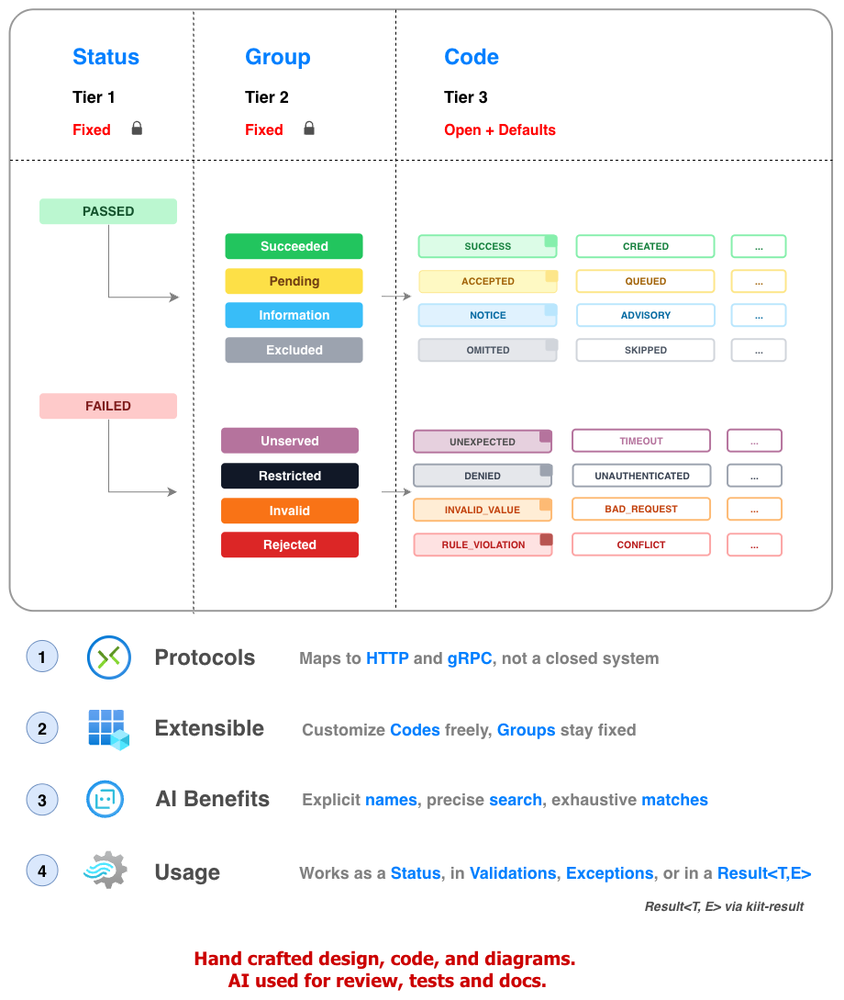
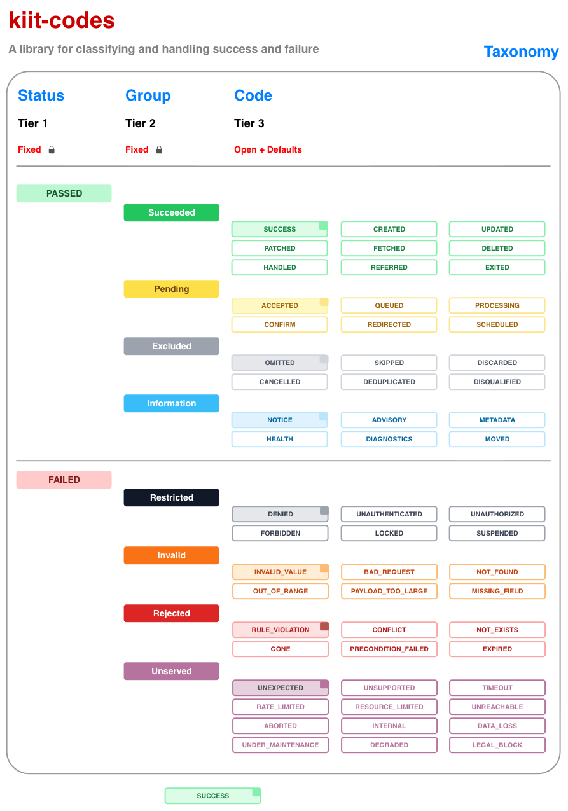
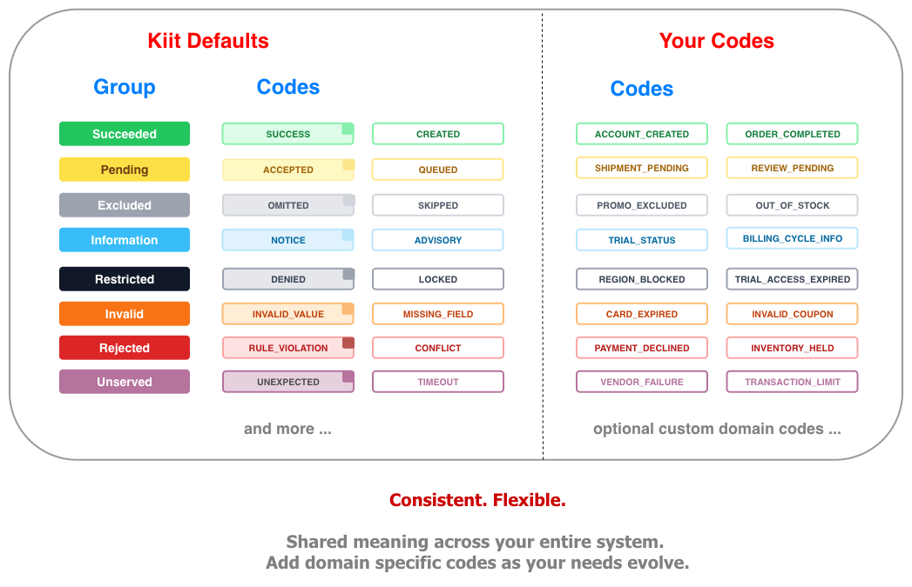
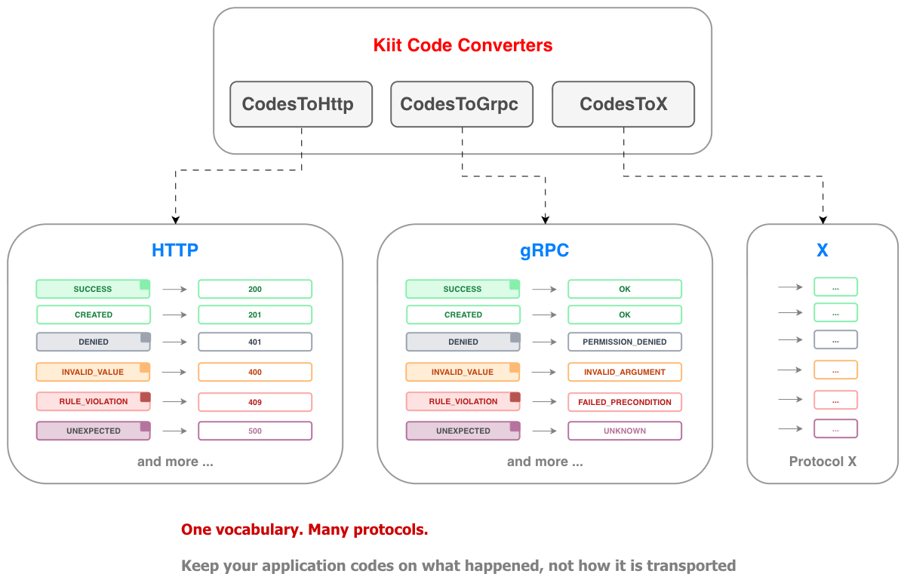
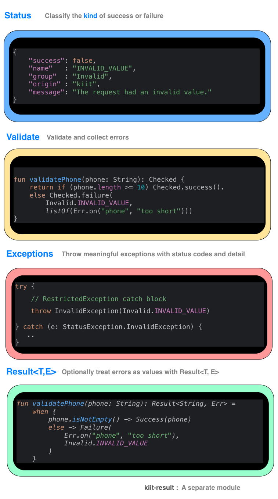

<div align="center">
<h1>
  
</h1>

# kiit-codes

**A Kotlin library for classifying and handling success and failure.**

A small, dependency-free status and error taxonomy for application outcomes, with extensible codes, protocol mappings, validation, typed exceptions, and optional `Result<T, E>` integration.

[](https://central.sonatype.com/artifact/dev.kiit/kiit-codes)
[](https://github.com/kiitdev/kiit-codes/actions/workflows/ci.yml)
[](./LICENSE)
[](https://kotlinlang.org)

Part of [Kiit](https://www.kiit.dev) · [Docs](https://www.kiit.dev/codes) · [Blog](#)

</div>



## 📚 Table of Contents

| # | | Topic | Description |
|---:|:---:|---|---|
| 1 | 💡 | [Why](#why) | Problems Codes is designed to solve |
| 2 | 🚀 | [Start](#start) | Installation and a quick example |
| 3 | 🗂️ | [Taxonomy](#taxonomy) | The Status → Group → Code model |
| 4 | 🧩 | [Extensibility](#extensibility) | Built-in and custom domain codes |
| 5 | 🔀 | [Protocols](#protocols) | HTTP, gRPC, and custom protocol mappings |
| 6 | ⚙️ | [Usage](#usage) | Status, validation, exceptions, and Result |
| 7 | 🗺️ | [Roadmap](#roadmap) | Planned improvements and future work |
| 8 | 📖 | [Learn More](#learn-more) | Deeper documentation and design topics |
| 9 | 📋 | [Requirements](#requirements) | Platforms and dependencies |
| 10 | 🤝 | [Contributing](#contributing) | Build, test, and contribute |
| 11 | 📄 | [License](#license) | Apache 2.0 license |

## Why
Applications need to communicate a simple idea consistently: **what happened?**

In practice, success and failure are often modeled differently across domains, application layers, protocols, and error-handling approaches. This creates several recurring problems:

|  # | Problem            | Description                                                             |
| -: |--------------------|-------------------------------------------------------------------------|
|  1 | **Classification** | No shared taxonomy for modeling success and failure.                    |
|  2 | **Consistency**    | Outcomes vary across application layers and protocols.                  |
|  3 | **Fragmentation**  | Validation, exceptions, statuses, and results use different approaches. |
|  4 | **Boilerplate**    | Similar error types and handling are rebuilt across projects and teams. |
|  5 | **Specificity**    | Generic errors often lack precise domain meaning.                       |

**kiit-codes provides a shared application-level model for these concerns.**

A fixed taxonomy provides consistent classification, extensible codes preserve domain-specific meaning, and protocol mappings keep application outcomes independent from their transport. The same model can then be used across statuses, validation, exceptions, and result types.

## Start

**Gradle (Kotlin DSL):**

```kotlin
dependencies {
    implementation("dev.kiit:kiit-codes:1.0.1")
}
```

A status can represent an outcome without requiring exceptions or a result type:

```kotlin
import kiit.codes.*

fun authorize(userId: String, requesterId: String): Status =
    if (userId != requesterId) Restricted.UNAUTHORIZED
    else Succeeded.SUCCESS

when (val status = authorize(userId, requesterId)) {
    is Passed -> log.info("ok: ${status.name}")
    is Failed -> log.warn("failed: ${status.name} — ${status.message}")
}
```

Built-in codes expose stable fields suitable for application logic, logging, APIs, and diagnostics:

```json
{
    "name"    : "CONFLICT",
    "group"   : "Rejected",
    "origin"  : "kiit",
    "success" : false,
    "message" : "The request conflicts with the current state"
}
```

## Taxonomy

Codes uses a three-tier model:

| Tier   | Name       | Fixed/Open | Suggested wording                                                      |
| ------ | ---------- | ---------- | ---------------------------------------------------------------------- |
| Tier 1 | **Status** | Fixed      | Classifies an outcome as `Passed` or `Failed`.                         |
| Tier 2 | **Group**  | Fixed      | Classifies the kind of success or failure.                             |
| Tier 3 | **Code**   | Open       | Identifies a specific outcome using built-in or domain-specific codes. |

**Status → Group → Code**

`Status` and `Group` are fixed so applications share the same high-level meaning. `Code` is open: Kiit supplies common defaults while applications can add their own domain-specific codes.



The two statuses are:

- **Passed** — `Succeeded`, `Pending`, `Excluded`, `Information`
- **Failed** — `Restricted`, `Invalid`, `Rejected`, `Unserved`

Each code provides an `id`, `name`, `group`, `origin`, `message`, and `success` flag. Built-in codes use the `kiit` origin and each group has a default code for cases where more precision is unnecessary.

The built-in taxonomy contains common application outcomes such as `SUCCESS`, `CREATED`, `DENIED`, `INVALID_VALUE`, `CONFLICT`, `TIMEOUT`, and `UNEXPECTED`.

## Extensibility

The taxonomy stays consistent while codes remain open to your domain.



Custom codes use the same group types as Kiit's defaults:

```kotlin
import kiit.codes.Failed

// Example custom code
val PAYMENT_DECLINED = Failed.Rejected(
    name = "PAYMENT_DECLINED",
    message = "Payment declined",
    origin = "payments"
)
```

`PAYMENT_DECLINED` remains a `Rejected` outcome everywhere in the system while retaining its domain-specific identity. The `origin` keeps custom namespaces distinct from Kiit and from other modules or teams.

## Protocols

Application outcomes should describe **what happened**, independently of how they are transported.

Kiit codes can be mapped to protocol-specific representations at system boundaries.



### HTTP

`CodesToHttp` maps statuses to HTTP codes using group defaults plus specific overrides where needed.

```kotlin
import kiit.codes.*

val http = CodesToHttp()

http.toCode(Succeeded.CREATED) // 201
http.toCode(Invalid.INVALID_VALUE) // 400
http.toStatus(404)?.name // "NOT_FOUND"
```

Reverse conversion is deterministic but can be lossy because multiple application codes may map to the same HTTP status.

### gRPC

`CodesToGrpc` follows the same model and covers all gRPC status codes.

```kotlin
import kiit.codes.*

val grpc = CodesToGrpc()

grpc.toCode(Restricted.DENIED)   // 7, PERMISSION_DENIED
grpc.toStatus(6)?.name           // "CONFLICT", ALREADY_EXISTS reversed
```

The mapping abstraction is not limited to HTTP and gRPC. `CodeLookup` and `CompositeLookup` can be used to define or extend mappings for other protocols.

```kotlin
val lookup = CompositeLookup(
    base = CodesToHttp(),
    extensions = mapOf(PAYMENT_DECLINED to 402)
)

lookup.toCode(PAYMENT_DECLINED) // 402
```

## Usage

Codes is designed to work at different application boundaries without requiring one error-handling style.

### Status

Use `Status` when the outcome itself is enough.

```kotlin
import kiit.codes.*

fun authorize(userId: String, requesterId: String): Status =
    if (userId != requesterId) Restricted.UNAUTHORIZED
    else Succeeded.SUCCESS

when (val status = authorize(userId, requesterId)) {
    is Passed -> log.info("ok: ${status.name}")
    is Failed -> log.warn("failed: ${status.name} — ${status.message}")
}
```



## Roadmap

kiit-codes has been extracted from kiit framework and polished as a standalone module.
This has been used in production for over 4+ years to power mobile and server kotlin applications.
Current work is focused on the Kotlin release, documentation, examples, and ecosystem integration.

| # | Topic | Description |
|---:|---|---|
| 1 | **Documentation** | Update documentation and examples as needed. |
| 2 | **TypeScript** | Add native TypeScript support with an idiomatic implementation of the same Codes taxonomy and semantics. |
| 3 | **Taxonomy** | Continue taxonomy review based on real-world usage and community feedback. |

See [GitHub Issues](https://github.com/kiitdev/kiit-codes/issues) for current work and discussions.

## Learn More

| # | Topic | Description |
|---:|---|---|
| 1 | **Taxonomy** | Explore every built-in group and code, their intended meanings, defaults, and distinctions. [Read the taxonomy docs](https://www.kiit.dev/docs/codes/taxonomy). |
| 2 | **Extensibility** | Learn how extensibility works and how to create domain-specific codes while keeping the shared taxonomy intact. [Read the extensibility docs](https://www.kiit.dev/docs/codes/extensibility). |
| 3 | **Protocols** | See the complete HTTP and gRPC mappings and learn how to create custom mappings. [Read the protocol docs](https://www.kiit.dev/docs/codes/protocols). |
| 4 | **Validation** | Learn how `Err`, `Checked`, and `collect` model validation and accumulate multiple errors. [Read the validation docs](https://www.kiit.dev/docs/codes/validation). |
| 5 | **Exceptions** | See the typed exception hierarchy and patterns for integrating Codes with exception-based boundaries. [Read the exception docs](https://www.kiit.dev/docs/codes/exceptions). |
| 6 | **Result** | Learn how the separate `kiit-result` module builds `Result<T, E>` handling on top of the same Codes taxonomy. [Read the Result docs](https://www.kiit.dev/docs/codes/result). |
| 7 | **FAQ** | Answers to common questions about the taxonomy, design choices, alternatives, adoption, AI considerations, and project maturity. [Read the FAQ](https://www.kiit.dev/docs/codes/faq). |
| 8 | **Design** | Read more about the reasoning behind fixed groups, extensible codes, protocol independence, and where Codes fits relative to domain errors. [Read the design docs](https://www.kiit.dev/docs/codes/design). |

## Requirements

- Kotlin Multiplatform
- JVM, Android, iOS (simulator, iosArm64, x64)
- No external runtime dependencies

## Contributing

Contributions and design feedback are welcome. See [BUILD.md](./BUILD.md) for build, test, and publish instructions.

## License

[Apache License 2.0](./LICENSE)

---

<div align="center">

**kiit-codes** is one module of [Kiit](https://www.kiit.dev) — a lightweight, modular Kotlin framework for building server applications, APIs, CLIs, and jobs.

**Adopt one module at a time.**

</div>
