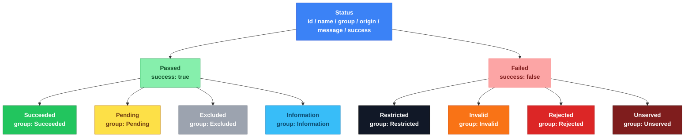

<div align="center">

# kiit.codes

**A status/error** taxonomy conceptually similar to Http Status Codes/gRPC codes for Kotlin — plus a complete, exception-based way to actually use it.

[](https://central.sonatype.com/artifact/dev.kiit/kiit-codes)
[](https://github.com/slatekit/kiit-codes/actions)
[](./LICENSE)
[](https://kotlinlang.org)

Part of the [Kiit](https://www.kiit.dev) framework · [kiit.dev/codes](https://www.kiit.dev/codes) · [Blog post](#) · [Video walkthrough](#)

</div>

---

## 📚 Table of Contents

| | Section | Description |
|---|---|---|
| ℹ️ | [About](#ℹ️-about) | What kiit.codes is and the taxonomy + exception model it provides |
| 🧩 | [The problem](#-the-problem) | Why exceptions, raw booleans, and borrowed HTTP codes don't compose well |
| 💡 | [The idea](#-the-idea) | A closed taxonomy of outcomes, layered on top of open, extensible codes |
| 🚀 | [Quick start](#-quick-start) | Install the library and see status, `Checked`, and exception examples |
| 🧠 | [Core concepts](#-core-concepts) | The `Status`/`Passed`/`Failed` hierarchy and how the pieces relate |
| 📖 | [Built-in codes](#-built-in-codes) | The `Codes` registry of common statuses, and how to add your own |
| 🌐 | [HTTP conversion](#-http-conversion) | Mapping a `Status` to and from a real HTTP status code |
| 🔌 | [gRPC conversion](#-grpc-conversion) | Mapping a `Status` to and from a real gRPC status code |
| 🧾 | [Err & Checked](#-err--checked) | Carrying per-occurrence error detail and reporting every problem at once |
| ⚠️ | [Exceptions](#️-exceptions) | The sealed `StatusException` family for exception-only call boundaries |
| 🛠️ | [Use cases](#️-use-cases) | Where this fits — services, APIs, background jobs, logging |
| ✅ | [When to use this](#-when-to-use-this-and-when-not-to) | Good-fit and not-necessary scenarios, so you can decide quickly |
| 📦 | [Requirements](#-requirements) | Supported platforms and the (lack of) runtime dependencies |
| 🗺️ | [Roadmap](#️-roadmap) | Publishing pipelines and CI work planned but not yet done |
| 🤝 | [Contributing](#-contributing) | How to build, test, and submit changes |
| 📄 | [License](#-license) | Licensing terms for this project |

---

## ℹ️ About

**kiit.codes** is a platform-agnostic set of status and error code types for Kotlin Multiplatform. It describes the outcome of any operation — a service call, a background job step, an API request, a CLI command — using a consistent, structured shape instead of raw exceptions or ad-hoc booleans.

It's really two things working together, not one:

1. **A closed taxonomy.** Every outcome is a `Status`, a stable `name`, a derived `id`, a `group`, an `origin`, a constant `message`, and a `success` flag, grouped into a small, fixed set of categories (`Succeeded`, `Pending`, `Excluded`, `Information`, `Restricted`, `Invalid`, `Rejected`, `Unserved`) that's consistent across every layer and every target — JVM, Android, JS/TypeScript, and iOS.
2. **A complete, exception-based way to use it.** `Checked` captures the actual detail behind a failure, and a sealed `StatusException` family lets you throw and catch that detail without ever losing structure, no `Result` type, no functional-programming buy-in required.

It's a small, dependency-free library — you can adopt it on its own, independent of the rest of [Kiit](https://www.kiit.dev). A separate module, `kiit-results`, builds a `Result<T, E>` type on top of this same taxonomy for anyone who prefers explicit return values over exceptions, but it isn't required to get real value out of this package alone.

```json
{
    "id"     : "kiit.TOKEN_EXPIRED",
    "name"   : "TOKEN_EXPIRED",
    "group"  : "Restricted",
    "origin" : "kiit",
    "success": false,
    "message": "Session token expired"
}
```

## 🧩 The problem

Most codebases end up with three incompatible ways of describing "what happened": exceptions (expensive, unstructured, and easy to over- or under-catch), raw booleans (`success: Boolean` — no room to say *why*), and ad-hoc HTTP status codes borrowed as a stand-in for domain meaning even outside an HTTP context.

None of these compose well. A background job doesn't have an HTTP status. A CLI command's "help was printed" isn't a failure, but it also isn't the same kind of success as "the record was created." And a huge amount of exception handling is boilerplate, the same custom exception class, rewritten per domain, mostly just to get dispatch and a place to stash a couple of fields.

## 💡 The idea

**kiit.codes is a closed taxonomy of outcomes, layered on top of open, extensible codes, with a real, exception-based way to act on both.**

The eight categories (`Passed = Succeeded | Pending | Excluded | Information`, `Failed = Restricted | Invalid | Rejected | Unserved`) are fixed by design — every consumer branches on the same shape. Individual codes *within* a category are yours to extend: construct a `Passed.*` or `Failed.*` subtype directly for any domain-specific outcome, tagged with your own `origin`, and it still slots into the same taxonomy for logging, aggregation, and HTTP conversion.

On top of that, `Checked` and a sealed `StatusException` give you a structured, compiler-checked replacement for most custom exception classes, not a taxonomy waiting for a second library to become useful.

## 🚀 Quick start

**Gradle (Kotlin DSL):**

```kotlin
dependencies {
    implementation("dev.kiit:kiit-codes:0.1.2")
}
```

**Return a status when the outcome itself is all the detail you need:**

```kotlin
import kiit.codes.*

fun authorize(userId: String, requesterId: String): Status =
    if (userId != requesterId) Codes.UNAUTHORIZED else Codes.SUCCESS
```

**Branch on the outcome, exhaustively:**

```kotlin
import kiit.codes.*

when (val status = authorize(userId, requesterId)) {
    is Passed -> log.info("ok: ${status.name}")
    is Failed -> log.warn("failed: ${status.name} — ${status.message}")
}
```

**Return `Checked` when a failure needs to carry *why*, not just *that*:**

```kotlin
import kiit.codes.*

fun createUser(email: String): Checked =
    if (users.containsKey(email)) {
        Checked.failure(Codes.CONFLICT, listOf(Err.on("email", email, "already registered")))
    } else {
        // ... create the user ...
        Checked.success(Codes.CREATED)
    }

val result = createUser(email)
if (!result.isValid) {
    log.warn("failed: ${result.status.name} — ${result.errors}")
}
```

**Report more than one problem at once with `collect`:**

```kotlin
import kiit.codes.*

fun checkEmail(email: String): Checked =
    if (email.contains("@")) Checked.success()
    else Checked.failure(Codes.INVALID_VALUE, listOf(Err.on("email", email, "must contain @")))

fun checkPhone(phone: String): Checked =
    if (phone.length >= 10) Checked.success()
    else Checked.failure(Codes.INVALID_VALUE, listOf(Err.on("phone", phone, "too short")))

val result = collect(checkEmail(email), checkPhone(phone))
if (!result.isValid) {
    // result.errors has every problem found, not just the first
}
```

**Throw with structure, catch with structure:**

```kotlin
import kiit.codes.*

throw StatusException.RestrictedException(Codes.UNAUTHORIZED)

try {
    // ...
} catch (e: StatusException.RestrictedException) {
    // handled without ever touching a when block
}
```

**Convert to HTTP when you need a real status code:**

```kotlin
import kiit.codes.*

val http = CodesToHttp()
http.toCode(Codes.CREATED)      // 201
http.toCode(Codes.DENIED)       // 401
```

See [`samples/sample1`](./samples/sample1) for a runnable end-to-end example.

## 🧠 Core concepts

```
Status = Passed     | Failed
Passed = Succeeded  | Pending | Excluded | Information
Failed = Restricted | Invalid | Rejected | Unserved
```


```mermaid
graph TD
    classDef statusNode        fill:#3b82f6,stroke:#1d4ed8,color:#ffffff,font-weight:bold
    classDef passedNode        fill:#86efac,stroke:#16a34a,color:#14532d,font-weight:bold
    classDef succeededNode     fill:#22c55e,stroke:#15803d,color:#ffffff,font-weight:bold
    classDef pendingNode       fill:#fde047,stroke:#ca8a04,color:#713f12,font-weight:bold
    classDef excludedNode      fill:#9ca3af,stroke:#6b7280,color:#ffffff,font-weight:bold
    classDef informationNode   fill:#38bdf8,stroke:#0284c7,color:#0c4a6e,font-weight:bold
    classDef failedNode        fill:#fca5a5,stroke:#f87171,color:#7f1d1d,font-weight:bold
    classDef restrictedNode    fill:#111827,stroke:#000000,color:#ffffff,font-weight:bold
    classDef invalidNode       fill:#f97316,stroke:#c2410c,color:#ffffff,font-weight:bold
    classDef rejectedNode      fill:#dc2626,stroke:#b91c1c,color:#ffffff,font-weight:bold
    classDef unservedNode      fill:#7f1d1d,stroke:#450a0a,color:#ffffff,font-weight:bold

    Status["Status<br/>id / name / group / origin / message / success"]:::statusNode

    Passed["Passed<br/>success: true"]:::passedNode
    Failed["Failed<br/>success: false"]:::failedNode

    Succeeded["Succeeded<br/>group: Succeeded"]:::succeededNode
    Pending["Pending<br/>group: Pending"]:::pendingNode
    Excluded["Excluded<br/>group: Excluded"]:::excludedNode
    Information["Information<br/>group: Information"]:::informationNode

    Restricted["Restricted<br/>group: Restricted"]:::restrictedNode
    Invalid["Invalid<br/>group: Invalid"]:::invalidNode
    Rejected["Rejected<br/>group: Rejected"]:::rejectedNode
    Unserved["Unserved<br/>group: Unserved"]:::unservedNode

    Status --> Passed
    Status --> Failed
    Passed --> Succeeded
    Passed --> Pending
    Passed --> Excluded
    Passed --> Information
    Failed --> Restricted
    Failed --> Invalid
    Failed --> Rejected
    Failed --> Unserved
```

| Term | What it is |
|---|---|
| **Status** | The outcome of an operation — `id`, `name`, `group`, `origin`, `message`, `success`. Sealed: `Passed` or `Failed`. |
| **Passed** | `Succeeded` (primary purpose completed), `Pending` (accepted, not yet done), `Excluded` (left out — not processed, processed and discarded, or omitted for any other reason), `Information` (metadata output, e.g. `HELP`). |
| **Failed** | `Restricted` (security/access-control), `Invalid` (bad input), `Rejected` (known business-rule failure), `Unserved` (valid & permitted, but can't be handled right now). |
| **id** | `"$origin.$name"`, derived, unique across every `Status` — usable as a map/lookup key without building the pair yourself. |
| **origin** | Where a code came from — `"kiit"` for built-ins, your own module or team name for custom codes. `id` (`origin.name`) is what's actually enforced unique, not `name` alone, so two teams can both have a code named `CONFLICT` without colliding. |
| **isNeutral** | Extension property, `true` only for `Excluded`/`Information` — the two categories that represent neither a genuine success nor a genuine failure. |
| **Codes** | The built-in registry of common `Status` instances — optional, and duplicate-checked at init time. |
| **CodeLookup** | Bidirectional conversion between a `Status` and a target protocol's code (`toCode`/`toStatus`), direction-explicit so the two code spaces can't be confused. |
| **Err** | A single piece of instance-level detail behind a failure, a field, a value, a cause — the thing `Status` deliberately doesn't carry on its own. |
| **Checked** | A `Status` plus zero or more `Err`, for reporting every problem found at once instead of stopping at the first one. `collect` combines several `Checked` into one. |
| **StatusException** | Sealed, carries a `Checked` across a call boundary that can only communicate via exceptions. One subtype per `Failed` category — `RestrictedException`, `InvalidException`, `RejectedException`, `UnservedException`. |

Every current member, by category:

Each category's fallback/default code is declared, and listed, first.

| Category | Members |
|---|---|
| Succeeded | `SUCCESS`, `CREATED`, `UPDATED`, `PATCHED`, `FETCHED`, `DELETED`, `HANDLED`, `REFERRED` |
| Pending | `ACCEPTED`, `QUEUED`, `PROCESSING`, `CONFIRM`, `REDIRECTED` |
| Excluded | `OMITTED`, `SKIPPED`, `DISCARDED`, `CANCELLED`, `DEDUPLICATED` |
| Information | `NOTICE`, `ADVISORY`, `HELP`, `ABOUT`, `VERSION`, `EXIT`, `MOVED` |
| Restricted | `DENIED`, `UNAUTHENTICATED`, `UNAUTHORIZED`, `FORBIDDEN`, `LOCKED`, `SUSPENDED` |
| Invalid | `INVALID_VALUE`, `BAD_REQUEST`, `NOT_FOUND`, `OUT_OF_RANGE`, `PAYLOAD_TOO_LARGE`, `MISSING_FIELD`, `INVALID_ENTITY` |
| Rejected | `RULE_VIOLATION`, `CONFLICT`, `NOT_EXISTS`, `PRECONDITION_FAILED`, `EXPIRED` |
| Unserved | `UNEXPECTED`, `UNIMPLEMENTED`, `UNSUPPORTED`, `TIMEOUT`, `RATE_LIMITED`, `RESOURCE_LIMITED`, `UNREACHABLE`, `UNDER_MAINTENANCE`, `INTERNAL`, `DATA_LOSS` |

## 📖 Built-in codes

The `Codes` object provides a standard registry — using it is optional, and you can construct any `Passed`/`Failed` subtype directly for domain-specific outcomes.

| Category | Examples |
|---|---|
| Succeeded | `SUCCESS` (generic fallback), `CREATED`, `UPDATED`, `PATCHED`, `FETCHED`, `DELETED`, `HANDLED`, `REFERRED` |
| Pending | `ACCEPTED` (generic fallback), `QUEUED`, `PROCESSING`, `CONFIRM`, `REDIRECTED` |
| Excluded | `OMITTED` (generic fallback), `SKIPPED` (not processed), `DISCARDED` (processed, result thrown away), `CANCELLED` (cancelled by caller), `DEDUPLICATED` |
| Information | `NOTICE` (generic fallback), `ADVISORY` (may need attention or action), `HELP`, `ABOUT`, `VERSION`, `EXIT`, `MOVED` (resource relocated permanently) |
| Restricted | `DENIED` (generic fallback), `UNAUTHENTICATED`, `UNAUTHORIZED`, `FORBIDDEN`, `LOCKED` (self-resolving), `SUSPENDED` (administrative) |
| Invalid | `INVALID_VALUE` (generic fallback), `BAD_REQUEST`, `NOT_FOUND` (route/request not found), `OUT_OF_RANGE`, `PAYLOAD_TOO_LARGE`, `MISSING_FIELD`, `INVALID_ENTITY` (HTTP `422`'s real case) |
| Rejected | `RULE_VIOLATION` (generic fallback), `CONFLICT`, `NOT_EXISTS` (entity-level not found), `PRECONDITION_FAILED`, `EXPIRED` |
| Unserved | `UNEXPECTED` (generic fallback), `UNIMPLEMENTED`, `UNSUPPORTED`, `TIMEOUT`, `RATE_LIMITED`, `RESOURCE_LIMITED`, `UNREACHABLE`, `UNDER_MAINTENANCE`, `INTERNAL`, `DATA_LOSS` |

A few pairs worth distinguishing on sight, without cross-referencing the source:

- **`RATE_LIMITED` vs `RESOURCE_LIMITED`** — too many requests per unit of time, vs a fixed amount consumed (storage, seats, quota) regardless of how quickly it was used.
- **`LOCKED` vs `SUSPENDED`** — self-resolving through caller action (e.g. verify identity), vs an administrative decision that doesn't resolve on its own.
- **`INVALID_VALUE` vs `MISSING_FIELD`** — present but wrong, vs never provided at all.
- **`INVALID_VALUE` vs `INVALID_ENTITY`** — a single value is wrong, vs several individually valid fields don't make sense together as a whole payload.
- **`NOTICE` vs `ADVISORY`** — purely neutral information, vs something that may need attention or action.
- **`NOT_FOUND` vs `NOT_EXISTS`** — route/request-level (client-integration error), vs entity-level (well-formed request, the thing just doesn't exist).
- **`EXPIRED` vs `NOT_EXISTS` vs `CONFLICT`** — was valid but timed out, vs never existed, vs exists but something else changed its state.

Every built-in code's `origin` is `"kiit"`. Custom codes should supply their own, a module or team name, rather than relying on a default, so uniqueness only has to hold within your own `origin`, not globally:

```kotlin
import kiit.codes.Failed

val PAYMENT_DECLINED = Failed.Rejected("PAYMENT_DECLINED", "Payment declined", origin = "payments")
```

Uniqueness over `id` (`origin.name`) is enforced at object-init time, a collision fails loudly the first time `Codes` is touched, rather than silently producing a wrong lookup later.

**Bar for adding a new built-in code:** independent validation (does it show up on its own in another mature system like HTTP or gRPC, not just reasoned through in isolation), and it must describe a one-shot operation outcome, not the ongoing state of some domain object (a paused subscription, a stopped worker — those belong as custom codes in the consuming domain, since their meaning varies too much per domain for one built-in definition to fit).

## 🌐 HTTP conversion

`CodesToHttp` maps `Status` to HTTP status codes: a compiler-exhaustive category default (`Succeeded` → 200, `Restricted` → 401, etc.), layered with a small overrides table, keyed by `Status` instance, for the handful of codes that differ (`CREATED` → 201, `NOT_FOUND` → 404). `toStatus` is derived from `toCode`, so the two directions can never drift out of sync — but the mapping is many-to-one (many different `Passed` codes all resolve to `200`), so `toStatus` is inherently lossy. It returns a deterministic canonical status for a given code, not necessarily the specific one you originally converted.

```kotlin
import kiit.codes.*

val http = CodesToHttp()
http.toStatus(404)?.name           // "NOT_FOUND" — deterministic even though NOT_EXISTS also maps to 404
http.toStatus(413)?.name           // "PAYLOAD_TOO_LARGE"
http.toStatus(307)?.name           // "REDIRECTED"
http.toCode(Codes.UPDATED)         // 200
http.toStatus(200)?.name           // "SUCCESS", not "UPDATED" — lossy, not a round trip
http.toStatus(999)                 // null — unrecognized code, no guessed fallback
```

A few overrides worth calling out specifically: `CANCELLED` → 499 (`Client Closed Request`, nginx-originated, not in the RFC but the de facto standard for this exact concept), `REDIRECTED` → 307 (`Temporary Redirect`, not 302, to preserve the original method and body), `PAYLOAD_TOO_LARGE` → 413 (exact match), `LOCKED` → 423 (WebDAV in origin, widely reused generally, exact match), `SUSPENDED` → 403 (closer to Forbidden than Unauthenticated — the caller is known), `EXPIRED` → 410 (`Gone`), `RESOURCE_LIMITED` → 429 (same axis as `RATE_LIMITED`, HTTP doesn't distinguish the two), `INVALID_ENTITY` → 422 (`Unprocessable Entity`, exact match). `MISSING_FIELD` and `DEDUPLICATED` need no override, they fall through cleanly to their category defaults (400 and 200 respectively).

`CompositeLookup` composes a base lookup with your own extensions, also keyed by `Status` instance so custom, unregistered statuses are reverse-lookupable too:

```kotlin
import kiit.codes.*

val lookup = CompositeLookup(base = CodesToHttp(), extensions = mapOf(PAYMENT_DECLINED to 402))
lookup.toCode(PAYMENT_DECLINED) // 402
```

## 🔌 gRPC conversion

`CodesToGrpc` maps `Status` to gRPC status codes (0-16) the same way `CodesToHttp` maps to HTTP: a compiler-exhaustive category default (`Passed` → 0 `OK`, `Restricted` → 7 `PERMISSION_DENIED`, `Invalid` → 3 `INVALID_ARGUMENT`, `Rejected` → 9 `FAILED_PRECONDITION`, `Unserved` → 13 `INTERNAL`), layered with an overrides table for codes that need their own dedicated gRPC code (`UNAUTHENTICATED` → 16, `TIMEOUT` → 4 `DEADLINE_EXCEEDED`, `RATE_LIMITED` → 8 `RESOURCE_EXHAUSTED`, and so on). `toStatus` is derived from `toCode` the same deterministic way as `CodesToHttp.toStatus`.

```kotlin
import kiit.codes.*

val grpc = CodesToGrpc()
grpc.toCode(Codes.DENIED)          // 7
grpc.toCode(Codes.TIMEOUT)         // 4
grpc.toStatus(9)?.name             // "PRECONDITION_FAILED" — deterministic canonical winner for that code
```

`CONFLICT` maps to 6 (`ALREADY_EXISTS`) — otherwise it would silently fall through to `Rejected`'s category default (9), which is the wrong signal for "this already exists." `RESOURCE_LIMITED` and `PAYLOAD_TOO_LARGE` both also map to 8 (`RESOURCE_EXHAUSTED`) alongside `RATE_LIMITED` — `RATE_LIMITED` is the official meaning, the other two are real-world conventions layered on top, not part of the spec.

**gRPC's `ABORTED` (10) has no dedicated code.** It's a real, narrow concept — "aborted, typically due to a concurrency issue such as a sequencer check failure or transaction abort" — but without independent validation elsewhere in the registry, it falls through to `Unserved`'s category default rather than getting its own code. This creates one accepted asymmetry: outgoing (`Status` → gRPC) is unaffected, anything on the category default still correctly returns `13` (`INTERNAL`); incoming, `CodesToGrpc().toStatus(10)` returns `null`, since nothing in the registry maps to `10`. A raw `ABORTED` received from an external gRPC service won't resolve to a `Status` automatically — callers need to handle that `null` explicitly. Every other gRPC code (0-16 except 10) resolves to a `Status`, either a dedicated code or the correct category default.

## 🧾 Err & Checked

`Status` describes the *kind* of outcome, not the specific value behind it. `Err` and `Checked` are what fill that in.

- **`Err`** carries one piece of real, per-occurrence detail — a field name, a bad value, an underlying `cause`.
- **`Checked`** pairs a `Status` with zero or more `Err`. Its constructor is private, only reachable through `success()`/`failure()`, so a passing `Checked` can never carry errors and a failing one can never be empty.
- **`collect`** combines several `Checked` into one, pooling every error from every failing entry, not just the first.

```kotlin
import kiit.codes.*

fun validateEmail(email: String): Checked =
    if (email.contains("@")) Checked.success()
    else Checked.failure(Codes.INVALID_VALUE, listOf(Err.on("email", "must contain @")))

fun validatePhone(phone: String): Checked =
    if (phone.length >= 10) Checked.success()
    else Checked.failure(Codes.INVALID_VALUE, listOf(Err.on("phone", "too short")))

val result = collect(validateEmail(email), validatePhone(phone))
if (!result.isValid) {
    // result.errors has every problem found, not just the first
}
```

`Checked` is deliberately non-monadic, no `map`/`flatMap`. Accumulate with `collect` before you have a value, don't chain afterward.

## ⚠️ Exceptions

`StatusException` is sealed, one subtype per `Failed` category, each carrying a `Checked` so no structure is lost crossing an exception-only boundary:

```kotlin
import kiit.codes.*

throw StatusException.RestrictedException(Codes.UNAUTHORIZED)

try {
    // ...
} catch (e: StatusException) {
    when (e) {
        is StatusException.RestrictedException    -> // handle auth failure
        is StatusException.InvalidException   -> // handle bad input
        is StatusException.RejectedException   -> // handle known business-rule failure
        is StatusException.UnservedException  -> // handle capacity / timeout / unimplemented / unexpected
    }
}
```

Or catch narrowly, by class, without ever touching a `when` block. Kotlin lets you import a nested class directly, which drops the `StatusException.` prefix at every call site without giving up the namespace protection nesting provides:

```kotlin
import kiit.codes.Codes
import kiit.codes.StatusException.RestrictedException

throw RestrictedException(Codes.UNAUTHENTICATED)

try {
    // ...
} catch (e: RestrictedException) {
    // handled without the StatusException. prefix, and without a when block
}
```

**This replaces most of what a custom exception class used to do.** A hand-rolled `RegistrationException` was usually doing three jobs at once, routing by class, carrying custom fields, and grouping a family of related failures. `Status`, `Checked`, and the sealed exception family already do all three, generally better, since dispatch and grouping are compiler-checked instead of left to a class hierarchy you maintain by hand.

**Before:**

```kotlin
class RegistrationException(
    val field: String,
    val reason: String,
) : Exception("$field: $reason")
```

**After:**

```kotlin
import kiit.codes.*

throw StatusException.InvalidException(Codes.INVALID_VALUE, listOf(Err.on("email", "already taken")))
```

If a named class is still useful for framework or crash-tooling reasons that dispatch on exception type specifically, each subtype is `open`, so it's a one-line addition, not a whole class with its own fields and catch logic:

```kotlin
import kiit.codes.*

class RegistrationException(status: Failed.Restricted, errors: List<Err> = emptyList()) :
    StatusException.RestrictedException(status, errors)
```

**Converting a bare `Failed` you already have in hand:**

```kotlin
import kiit.codes.*

fun Failed.toException(errors: List<Err> = emptyList()): StatusException =
    when (this) {
        is Failed.Restricted -> StatusException.RestrictedException(this, errors)
        is Failed.Invalid    -> StatusException.InvalidException(this, errors)
        is Failed.Rejected   -> StatusException.RejectedException(this, errors)
        is Failed.Unserved   -> StatusException.UnservedException(this, errors)
    }
```

## 🛠️ Use cases

1. **Service layers** — return a `Status` instead of throwing for expected failures; reserve exceptions for boundary crossings.
2. **Validation** — `Checked` and `collect` report every problem found at once, not just the first.
3. **API responses** — a consistent, structured error body across every endpoint, convertible to a real HTTP code via `CodesToHttp`.
4. **Existing, exception-based codebases** — `StatusException` supplements exceptions rather than replacing them, adopt it in one service or one endpoint without a rewrite.
5. **Background jobs / CLIs** — `Pending`/`Information` categories that don't map cleanly to HTTP but still need a consistent shape.
6. **Logging & metrics** — `name`, `group`, and `origin` are stable, aggregable, and searchable keys, for humans and for AI tooling reading the codebase.
7. **Cross-platform consumers** — the same taxonomy on JVM, Android, JS/TypeScript, and iOS.

## ✅ When to use this and when not to

**Good fit if:**
1. You want one consistent shape for "what happened" across services, jobs, APIs, and CLIs.
2. You're tired of writing a new custom exception class for every domain, just to get dispatch and a couple of fields.
3. You need to convert internal outcomes to HTTP (or another protocol) without hardcoding numeric ranges.
4. You're building or consuming a Kotlin Multiplatform target (JS/iOS) and want idiomatic error types on each side.

**Probably not necessary if:**
1. Your app is entirely internal, single-platform, and exceptions already communicate everything you need.
2. You want explicit, monadic return values (`Result<T, E>`) rather than throw/catch, in which case see [kiit-results](https://github.com/slatekit/kiit), which builds on this same taxonomy.

## 📦 Requirements

1. Kotlin Multiplatform — JVM, Android, JS (IR), iOS (arm64, simulator arm64, x64)
2. No external runtime dependencies

## 🗺️ Roadmap

- [ ] npm publish pipeline for JS consumers (`@kiit/codes`)
- [ ] SPM / XCFramework pipeline for Swift consumers
- [ ] GitHub Actions workflow for CI + Maven Central publish

Track progress or open a discussion in [Issues](https://github.com/slatekit/kiit-codes/issues).

## 🤝 Contributing

Contributions are welcome — see [BUILD.md](./BUILD.md) for build, test, and publish instructions.

## 📄 License

[Apache License 2.0](./LICENSE)

---

<div align="center">

kiit.codes is one module of **[Kiit](https://www.kiit.dev)** — a lightweight, modular, 100% Kotlin framework for building server apps, APIs, CLIs, and jobs. Adopt one module at a time.

</div>
